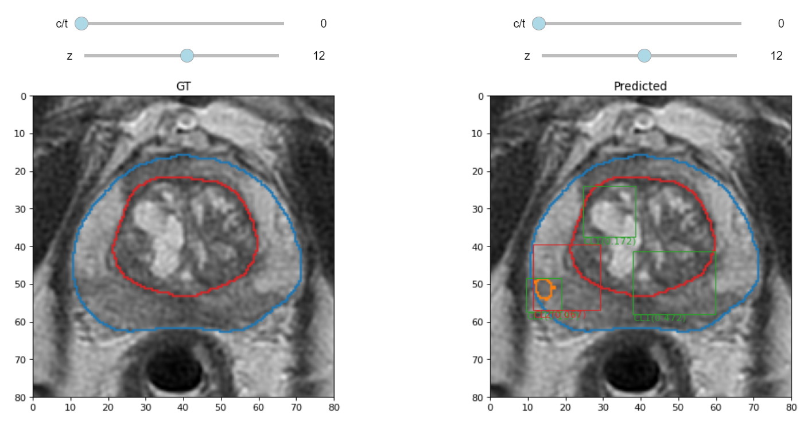
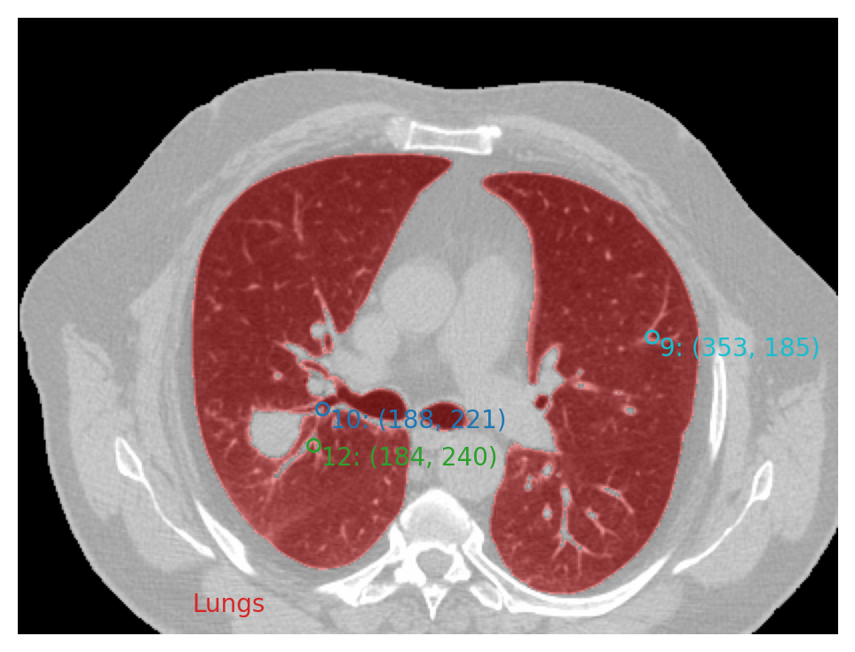

# plot_lib

Simple python library for quickly plotting 2D, 3D and 4D interactive images within Jupyter Notebooks, with the goals of being simple (call plot(image) and done!, plots should look very good by default), versatile (can easily plot masks, points and boxes along with the image) and hackable (the code is very simple and any missing functinality can be easily added).

It was originally designed as a quick way to explore medical images in the context of semantic segmentation, detection, etc., allowing to plot small interactive visualizations within Jupyter Notebooks.

## Examples

Please, look at the Notebook: [Introduction to plot_lib](Introduction%20to%20plot_lib.ipynb) for further information and examples. Some examples of the kind of output it can generate:




## Requirements and installation

To install and use, please clone this repository and install required packages:
```bash
git clone https://github.com/OscarPellicer/plot_lib.git

#Install required libs using pip or conda
pip install matplotlib, numpy, ipywidgets, ipython, scipy
#conda install matplotlib, numpy, ipywidgets, ipython, scipy
#conda install simpleitk --channel simpleitk

#(Optional) Install packages required by the demo Notebook
pip install pandas, urlib, tarfile
#conda install pandas, urlib, tarfile

```

The basic usage is the following:
```python
from plot_lib import plot
plot(np.zeros([100]*3))
```

## Non-exhaustive list of features:
 * Plot 2D, 3D and 4D (image channel or time dimension) interactive images (sliders allow exploration of 3D and 4D images)
 * Publication-quality images
 * Represent simulateneously images, masks, boxes, labels, points, etc.
